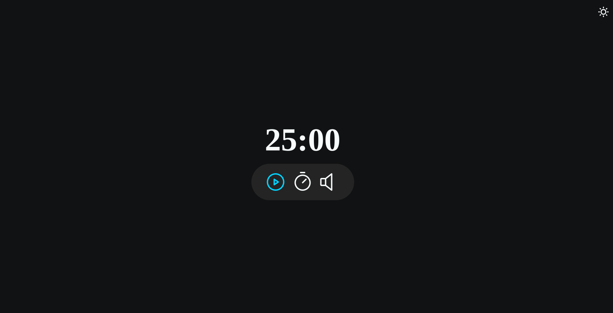

# Focus Timer v2

> Explorer - Stage 5

Projeto construído no curso Explorer da Rocketseat Stage 5.

[Clique aqui para acessar](https://andreliciosantos.github.io/Focus_timer_v2/)

## 🛠 Tecnologias 

- HTML
- CSS
- JS
- Git e Github

## 💛 Contato

andreliciosantos@gmail.com  
[Linkedin](www.linkedin.com/in/andreliciosantos)  
[Instagram](https://www.instagram.com/andreliciosantos/)
